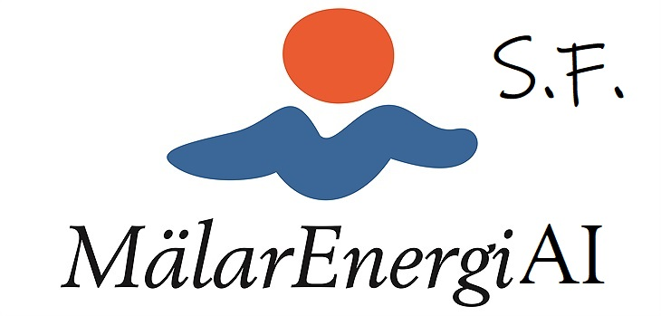
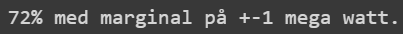

# MalarenergiAI
Litet AI projekt där man ska förutspå värden på saker :)

  

  
  
## Innehåll
Projektet innefattar flertalet python-program som sorterar och omformaterar datan som användes i träningen av modellerna. De olika versionerna av datan ligger även sparade i en separat mapp. Python-program som hämtar data från SMHIs API finns också, samt en HTML-fil där alla nödvändiga program kombinerats.  
## Hur du kommer igång
Jag vet inte lol  
## Planen & Processen
En AI-modell i Python som kan förutspå förbrukningen i MWh i ett husområde utifrån temperatur och årstid. En inblick i arbetets gång finns även lagrad i form av textfiler i mappen "meeting_notes"
### Delmål
1.  Läsa in data
3.  Formatera data
4.  Lista ut AI delen
5.  Utvärderade sannolikheten
6.  Presentera svar, grafiskt.
## Uppgifter
SMHI - Saga och Linus  
Läsa in och formatera data - Carl  
Användar gränssnitt - Ida  
Undersöker olika modeller - Lisa och Mathias  
    ------------  
Grafisk interface - Carl, Mathias och Ida  
Snygga till interface - Linus  
Hämta realtidsvärden - Saga  
Sammanställa programmet och dela upp - Lisa  

## Resultat
Genom random forest och datan från Surahammar lyckades vi få en träffsäkerhet på ca 99% med en felmarginal på +- 3 MWh samt ca 72% med en felmarginal på +- 1 MWh.  

  

  
 
Utöver datan som teamet blev försedda med användes även vindhastighet samt soltimmar i området. Däremot släpptes sedan soltimmar och vindhastighet på grund av sin obefintliga påverkan. I den färdiga produkten hämtas den förutspådda datan i form av temperatur från SMHIs API. Den möjliga datan som du kan hämta har därför en räckvidd på nio dagar framåt. Däremot minskar antalet datapunkter ju längre från "idag" du hämtar datan, vilket vi löst genom att ta medelvärdet för att därför behålla antalet datapunkter.

  

 
